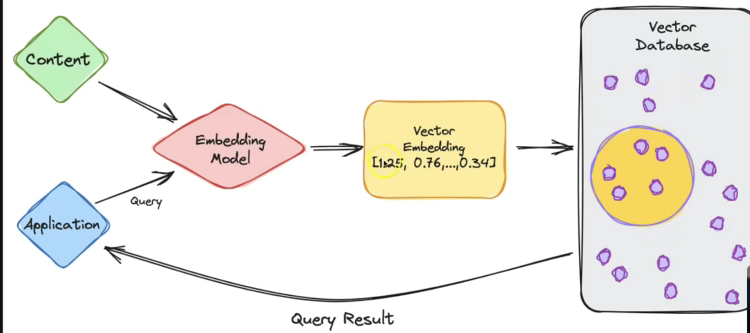

# Gemini API – Tokens, Usage, Streaming & Embeddings  
**Model Used: gemini-2.5-flash**

---

# 📌 1️⃣ What is a Token (Gemini Context)

A **token** is a small unit of text that the Gemini model processes.

It can be:
- A word → `India`
- Part of a word → `comput` + `er`
- A symbol → `?` `.`

Gemini converts your input text into tokens before generating a response.

### Example

```
"Hello world!"
→ ["Hello", " world", "!"]
```

---

# 📌 2️⃣ Why Tokens Are Important

Tokens affect:

### ✅ Cost
Gemini pricing is based on:
```
Input tokens + Output tokens
```

### ✅ Context Length
Every model has a maximum token limit.

### ✅ Performance
More tokens = more processing time.

### ✅ Prompt Design
Efficient prompts:
- Save tokens
- Reduce cost
- Improve performance

⚠️ If token limit is exceeded → request fails or response gets cut.

---

# 📌 3️⃣ How to Estimate Tokens in Gemini

Gemini does **NOT** expose exact token counts like OpenAI.

Google uses character-based estimation.

### Approximation Rule
```
1 token ≈ 4 characters (English)
```

### Manual Estimation
```
tokens ≈ text.length / 4
```

Example:
```
400 characters ≈ 100 tokens
```

### Utility Function

```js
function estimateTokens(text) {
  return Math.ceil(text.length / 4);
}
```

⚠️ `tiktoken` is ONLY for OpenAI, not Gemini.

---

# 📌 4️⃣ Important Token Notes

- Input + Output tokens both counted
- System instructions consume tokens
- Long chat history increases token usage
- Images, PDFs, and files also consume tokens internally
- Gemini handles larger context better than older models

### ✅ Best Practices
- Trim chat history
- Avoid unnecessary verbosity
- Use bullet prompts instead of long paragraphs
- Chunk large documents

---

# 📌 5️⃣ Gemini API – Basic Example

```js
import { GoogleGenerativeAI } from "@google/generative-ai";

const genAI = new GoogleGenerativeAI(process.env.GEMINI_API_KEY);

const model = genAI.getGenerativeModel({
  model: "gemini-2.5-flash",
});

const result = await model.generateContent("Explain tokens in LLMs");

console.log(result.response.text());
```

---

# 📌 6️⃣ Gemini Optional Parameters

---

## 🔹 Temperature

Controls randomness / creativity.

| Temperature | Output Style |
|------------|-------------|
| 0.0 – 0.2  | Strict, factual |
| 0.3 – 0.6  | Balanced (Recommended) |
| 0.7 – 1.0  | Creative, varied |

### Code

```js
const model = genAI.getGenerativeModel({
  model: "gemini-2.5-flash",
  generationConfig: {
    temperature: 0.4,
  },
});
```

📌 Interview Line:  
Temperature controls how predictable or creative the model’s output is.

---

## 🔹 Max Output Tokens

Limits response length.

- Prevents huge responses
- Controls cost
- Avoids verbosity

### Code

```js
const model = genAI.getGenerativeModel({
  model: "gemini-2.5-flash",
  generationConfig: {
    maxOutputTokens: 150,
  },
});
```

📌 Interview Line:  
`maxOutputTokens` controls the maximum length of generated output.

---

# 📌 7️⃣ Response Storage (Gemini is Stateless)

Gemini does **NOT** store response IDs.

You must handle storage manually.

### Example

```js
import { randomUUID } from "crypto";

const id = randomUUID();

const result = await model.generateContent("Explain LLMs");

const responseText = result.response.text();

const storedResponse = {
  id,
  prompt: "Explain LLMs",
  response: responseText,
  createdAt: new Date(),
};
```

Store in:
- Memory
- File
- MongoDB
- PostgreSQL
- Redis

📌 Interview Line:  
Gemini APIs are stateless; response storage must be handled client-side.

---

# 📌 8️⃣ Streaming in Gemini

---

## 🔹 What is Streaming?

Instead of waiting for full response, Gemini sends chunks.

### Normal
```
User waits...
Full response appears
```

### Streaming
```
He
Hello
Hello wor
Hello world!
```

Feels instant.

---

## 🔹 Terminal Streaming

```js
const stream = await model.generateContentStream(prompt);

for await (const chunk of stream.stream) {
  process.stdout.write(chunk.text());
}
```

---

## 🔹 Browser Streaming Flow

```
Browser → Server → Gemini (stream)
                     ↓
                  chunks
                     ↓
              Browser UI updates
```

Common methods:
- Server-Sent Events (SSE)
- WebSockets
- Fetch streams (ReadableStream)

⚠️ Gemini handles API streaming only.  
UI streaming is developer’s responsibility.

---

# 📌 9️⃣ Embeddings in Gemini

---

## 🔹 What is an Embedding?

An embedding converts text into numbers so machines understand meaning.

Example:

| Text | Meaning |
|------|---------|
| I love cats | 🐱❤️ |
| I adore kittens | 🐱❤️ |

Similar meaning → vectors are close in space.

Technical Definition:

> An embedding is a high-dimensional numerical vector representing semantic meaning.

---

## 🔹 Gemini Embedding Model

```
text-embedding-004
```

Used for:
- Semantic search
- Recommendations
- Clustering
- RAG
- Duplicate detection

---

## 🔹 Generate Embedding (Node.js)

### gemini/embeddingClient.js

```js
import { GoogleGenerativeAI } from "@google/generative-ai";

const genAI = new GoogleGenerativeAI(process.env.GOOGLE_API_KEY);

export async function generateEmbedding(text) {
  const model = genAI.getGenerativeModel({
    model: "text-embedding-004",
  });

  const result = await model.embedContent(text);

  return result.embedding.values;
}
```

---

## 🔹 Example Usage

```js
import { generateEmbedding } from "./gemini/embeddingClient.js";

const embedding = await generateEmbedding("I love cats");

console.log(embedding.length); // ~768 or 1024 dimensions
```

---

## 🔹 Cosine Similarity

```js
function cosineSimilarity(vecA, vecB) {
  const dot = vecA.reduce((sum, v, i) => sum + v * vecB[i], 0);
  const magA = Math.sqrt(vecA.reduce((sum, v) => sum + v * v, 0));
  const magB = Math.sqrt(vecB.reduce((sum, v) => sum + v * v, 0));
  return dot / (magA * magB);
}
```

---

# 📌 1️⃣0️⃣ RAG Flow (Very Important)

```
User Query
    ↓
Generate Embedding
    ↓
Vector Similarity Search
    ↓
Retrieve Relevant Documents
    ↓
Send to Gemini LLM
```

---

# 📌 Interview Quick Revision

### Q1. What is a token?
Smallest unit of text processed by an LLM.

### Q2. Does Gemini use tiktoken?
No. Gemini does not provide an official tokenizer.

### Q3. What is streaming?
Receiving response chunk-by-chunk instead of all at once.

### Q4. What is an embedding?
A numerical vector representing semantic meaning.

### Q5. Difference between Embeddings & LLM?

| Embeddings | LLM |
|------------|------|
| Outputs numbers | Generates text |
| Used for search | Used for reasoning |
| Fast & cheap | Slower & expensive |

---

# 🧠 Mental Model

Gemini Streaming =  
Response is a **flowing river**, not a bucket.

Embeddings =  
Bridge between human language and ML math.

---

# ✅ Key Takeaways

- Tokens ≈ characters / 4
- Gemini is stateless
- Streaming improves UX
- Embeddings power semantic search
- RAG = Embeddings + LLM

---

# 🧠 Semantic Search & Embeddings – Complete Notes

---

# 1️⃣ Generate Embedding for Data

## 📌 What is an Embedding?

An embedding is a numerical vector representation of text.

Example:
"Hello world" → [0.0123, -0.9981, 0.3345, ...]

Instead of matching words directly, we match meaning using vectors.

---

## 📌 Why Generate Embeddings for Data?

We convert:
- Documents
- Notes
- FAQs
- Articles

into vectors so we can later:
- Compare similarity
- Perform semantic search
- Build RAG systems

---

## 📌 Embedding Flow

Raw Text → Gemini Embedding Model → Vector → Store in DB / JSON

---

## 📌 Code Example

```js
const response = await ai.models.embedContent({
  model: "gemini-embedding-001",
  contents: texts.map(text => ({
    role: "user",
    parts: [{ text }]
  }))
});
```

---

# 2️⃣ Generate Embedding for Question

## 📌 Why?

To compare a user’s query with stored document embeddings.

If:
Document embeddings = stored vectors
Query embedding = new vector

Then:
We compare them using cosine similarity.

---

## 📌 Code Example

```js
const response = await ai.models.embedContent({
  model: "gemini-embedding-001",
  contents: [
    {
      role: "user",
      parts: [{ text: query }]
    }
  ]
});

const queryEmbedding = response.embeddings[0].values;
```

---

# 3️⃣ Display Match (Cosine Similarity)

## 📌 What is Cosine Similarity?

It measures angle between two vectors.

Formula:

cos(θ) = (A · B) / (|A| × |B|)

Range:
- 1 → Very similar
- 0 → Unrelated
- -1 → Opposite meaning

---

## 📌 Why Cosine?

Because:
- Embedding magnitude doesn't matter
- Direction matters
- Works well for high-dimensional vectors

---

## 📌 Manual Cosine Function

```js
export function cosineSimilarity(a, b) {
  const dot = a.reduce((sum, val, i) => sum + val * b[i], 0);
  const magA = Math.sqrt(a.reduce((sum, val) => sum + val * val, 0));
  const magB = Math.sqrt(b.reduce((sum, val) => sum + val * val, 0));
  return dot / (magA * magB);
}
```

---

## 📌 Matching Logic

```js
let bestMatch = null;
let highestScore = -1;

for (const item of storedData) {
  const score = cosineSimilarity(queryEmbedding, item.embedding);

  if (score > highestScore) {
    highestScore = score;
    bestMatch = item.text;
  }
}
```

---

# 4️⃣ Interview Questions

## 🧩 Basic Questions

1. What is an embedding?
2. Why do we use embeddings?
3. What is vector dimensionality?
4. Why cosine similarity over Euclidean distance?
5. What is semantic search?

---


## 🧠 Intermediate Questions

1. Difference between lexical search and semantic search?
2. What is vector normalization?
3. What is RAG?
4. Why use vector databases?
5. What happens if embedding dimensions mismatch?

---

## 🚀 Advanced Questions

1. How do vector databases optimize search?
2. What is Approximate Nearest Neighbor (ANN)?
3. Why is high dimensionality useful?
4. What is the curse of dimensionality?
5. How would you scale semantic search for millions of records?

---

# 5️⃣ Code & Notes (Project Architecture)

## 📁 Folder Structure

```
semantic-search/
│
├── index.js
├── embedData.js
├── similarity.js
├── data.json
├── embeddings.json
├── .env
├── package.json
```

---

## 📌 Packages Required

```bash
npm install @google/genai dotenv
```

---

## 📌 Environment File

```
GEMINI_API_KEY=your_key_here
```

---

# 🔥 What You Built

You built:

✔ Embedding pipeline  
✔ Vector storage system  
✔ Semantic search engine  
✔ Similarity ranking system  
✔ Foundation of RAG  

---

# 🎯 Real-World Upgrade Path

Level 1 → JSON storage  
Level 2 → Express API  
Level 3 → Vector DB (Pinecone, Weaviate)  
Level 4 → Full RAG (Embedding + LLM generation)  
Level 5 → Production-ready AI backend  

---

# 💡 Key Takeaways

- Embeddings convert meaning into math
- Cosine similarity measures semantic closeness
- Vector databases scale semantic search
- RAG = Retrieval + LLM generation
- This is core backend AI engineering skill

---

